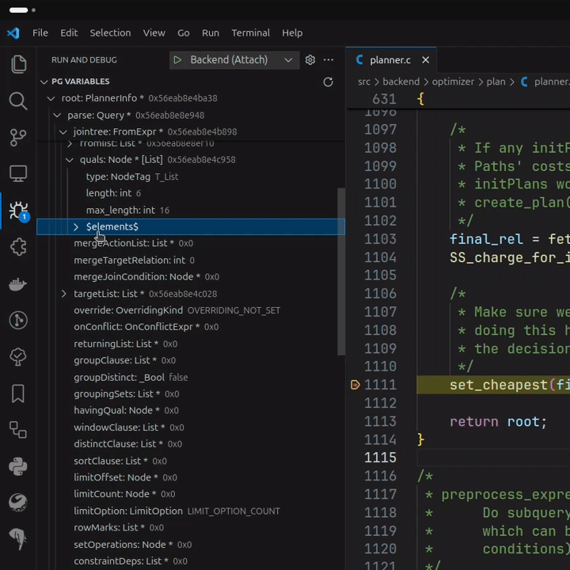
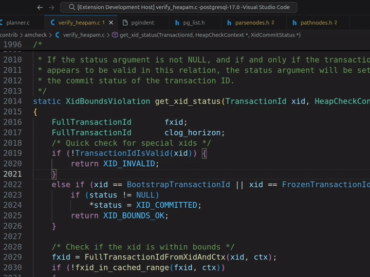
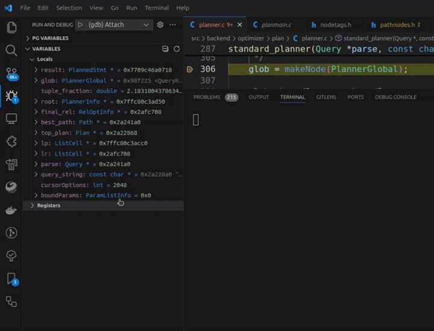
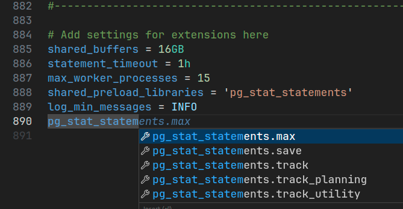

# PostgreSQL Hacker Helper

This is a Visual Studio Code extension to assist PostgreSQL source code developers:

- Exploring Postgres variables (`Node *`, `HTAB *`, `List *`, `Bitmapset *`, etc...)
- Code formatting using `pgindent`
- Syntax and completion support for `postgresql.conf`
- Extension bootstrapping

## Features

### Postgres Variables

Extension provides assistance with postgres variables:

- View `Node *` variables with real type according to `NodeTag`
- Get the contents of container types: `List *`, `HTAB *`, `Bitmapset *`
- Render `Expr` nodes by the original expression
- Show integer enums as enum values, not integers

Extension creates separate view in debug section - `PG Variables`. It contains postgres variables - extended with knowledge of source code.

- `Node *` variables casted to types according to `NodeTag`
- Container types show their elements:
  - `List *` (with support for scalars)
  - `HTAB *`
  - simplehash (`lib/simplehash.h`)
  - `Bitmapset *`
- Render `Expr` nodes by the original expression
- `Bitmapset *` elements (numbers) store references to which they point, i.e. `Relids` will store `RelOptInfo` and `RangeTable` references
- `List *` can support custom pointer types (not `Node *` types)
- Some types are rendered in more convenient way, i.e.:
  - `XLogRecPtr` - `File/Offset`
  - `RelFileLocator` - `spc/db/file`
  - `RangeTblEntry` - `alias` or `eref` value
  - `NameData` - string value directly
- Enum values, which defined using preprocessor (`#define`) are shown as enum values, not integers.

### Configuration file

Extension has configuration file - `.vscode/pgsql_hacker_helper.json`.
Main purpose is to allow to define container elements custom types, i.e. when you are developing a contrib.

It allows adding information about:

- Custom array types (with dynamic length evaluation using provided expressions)
- Pointer types in `List *`, which are not Node-derived
- HashTable entry types for both `HTAB` and `simplehash`
- Custom `typedefs.list` files for formatter

Also there is VS Code settings with generic behavior customization.

For more info check [configuration file documentation](./docs/configuration.md).

### Formatting

Extension uses `pgindent` for formatting C code. It integrates with VS Code extension and available with `Format Document` or `Ctrl + Shift + I` shortcut (or another key binding if overridden). Or you can just specify formatter manually using `Format Document With...` - select `PostgreSQL Hacker Helper` in pick up box.

Feature supported for PostgreSQL starting from 10 version.

> This feature using tools from `src/tools`. If they are unavailable extension will try to build or download them.
>
> Primary tool required is `pg_bsd_indent` - extension will try to build it.
> For this `pg_config` is used, but if extension fails to find it you will be prompted to enter path to it.

Using command `PGHH: Show diff preview for PostgreSQL formatter` you can
preview changes made by formatter.

Also, you can add your custom `typedefs.list` files and extension will use it during formatting (`"typedefs"`). For more info check [documentation](docs/configuration.md#custom-typedefslist).

### Dump `Node *`

In PostgreSQL there is `pprint(Node *)` which dumps passed Node variable to
stdout with pretty printing it. Using 'Dump Node to log' option in variable
context menu you also will be able to do so.

Also, you can dump `Node *` into newly created document and work with it as text file.
There is `Dump Node to document` option in variable context menu.

### Extension bootstrapping

Extension can help with creation of basic PostgreSQL extension files: Makefile, control file, source files (C, SQL) and tests.

Just run command `Bootstrap extension` and enter initial values (extension name, description, required files). Extension will be created inside `contrib` directory.

### `postgresql.conf` syntax support

PostgreSQL configuration files `postgresql.conf` and `postgresql.auto.conf` have syntax support.
Also, for there is autocompletion for configuration parameters also with default contrib's GUCs.

This syntax must be enabled for `postgresql[.auto].conf` files, but you can specify it using 'Change Language Mode' -> 'PostgreSQL configuration'

## Compatibility

Compatibility is ensured using testing. Minimal supported versions are **PostgreSQL 9.6** and **VS Code 1.70**.

There are 2 supported debugger extensions:

- [C/C++](https://marketplace.visualstudio.com/items?itemName=ms-vscode.cpptools) from **1.12**
- [CodeLLDB](https://marketplace.visualstudio.com/items?itemName=vadimcn.vscode-lldb) from **11.0**

Extension always tested on *latest version of debugger* and do not tries to be compatible with old ones due to *possible* large/breaking changes in behavior (most features implemented using hacks).

For using formatter minimal supported version Postgres is `10`.

## Testing

Directory [`./src/test`](./src/test) contains multiple staff for extension testing.
You can read [README](./src/test/README.md) to look at testing process.

For variables testing is performed using matrix: PG Version x VS Code Version x Debugger.
Each dimension contains all supported values: 9 (PG Versions) x 4 (VS Code Versions) x 2 (Debuggers) = 72 tests in total.

For formatting testing is performed using matrix: PG Version x VS Code Version (36 tests in total).

## Known Issues

Known issues:

- If in pointer variable was garbage, extension will not detect it and expand this variable (may be garbage).
  Usually, this will not lead to fatal errors, just note this.
- To get `NodeTag`s extension reads all available NodeTag files (from settings),
  but these files may be not created (./configure or make not run). I assume by
  time of debugging start files will be created, so extension catch them and process.
- Sometimes formatting can misbehave. This is due to `pg_bsd_indent` internal
  logic. If formatting is not applied check logs of an extension - it may contain
  error messages.
- Some operations require data to be allocated (usually, for function invocation).
  For this, `palloc` and `pfree` are used. So if you are debugging memory subsystem
  you may want to disable extension, because it may affect debugging process.
- Some operations require for some work to be done with system catalog.
  For example, to get function name using it's Oid. So, system catalog (system cache)
  can be modified during extension work.

## Contributing

Go to [Issues](https://github.com/ashenBlade/postgres-dev-helper/issues) if you want to say something: bugs, features, etc...
