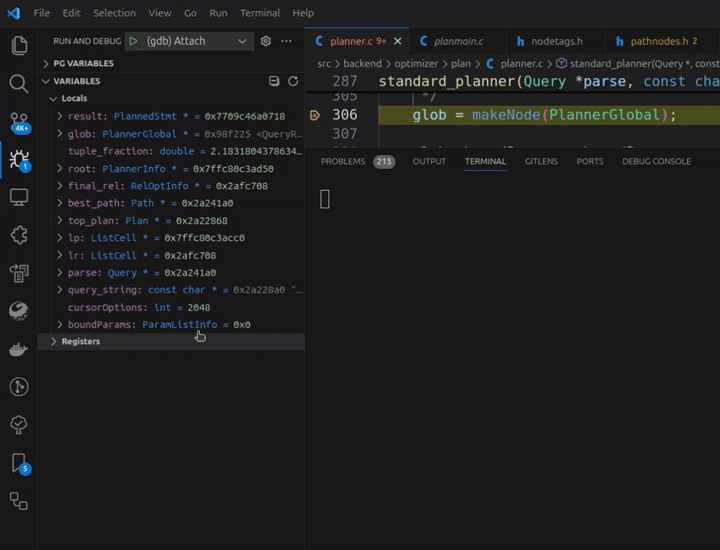

# PostgreSQL Hacker Helper


This is a Visual Studio Code extension to assist PostgreSQL source code developers:

- Exploring Postgres variables (`Node *`, container types, etc...)
- Format code with `pgindent`

## Features

### Postgres Variables

Extension provides assistance with postgres variables:

- View `Node *` variables with real type according to `NodeTag`
- Get the contents of container types: `List *`, `HTAB *`, `Bitmapset *`
- Render `Expr` nodes by the original expression

> More info you can find in documentation for [`PG Variables` view](docs/pg_variables.md).

Extension creates separate view in debug section - `PG Variables`. It contains postgres variables - extended with knowledge of source code.


- `Node *` variables casted to types according to `NodeTag`
- Container types show their elements:
  - `List *` (with support for scalars)
  - `HTAB *`
  - simplehash (`lib/simplehash.h`)
  - `Bitmapset *`
- Render `Expr` nodes by the original expression
- `Bitmapset *` elements (numbers) store references to which they point, i.e. `Relids` will store `RelOptInfo` and `RangeTable` references
- `List *` can support custom pointer types (not `Node *` types)
- Some scalar types are rendered in more convenient way, i.e. `XLogRecPtr` displayed in `File/Offset` form - not integer

### Configuration file

Extension has configuration file - `.vscode/pgsql_hacker_helper.json`.
Main purpose is to allow to define container elements custom types, i.e. when you are developing a contrib.

Example json:

```json
{
    "arrays": [
        {
            "typeName": "PlannerInfo",
            "memberName": "simple_rel_array",
            "lengthExpression": "simple_rel_array_size"
        },
        {
            "typeName": "RelOptInfo",
            "memberName": "partexprs",
            "lengthExpression": "part_scheme->partnatts"
        },
        {
            "typeName": "GatherMergeState",
            "memberName": "gm_slots",
            "lengthExpression": "nreaders + 1"
        }
    ],
    "aliases": [
        {
            "alias": "PlannerRef",
            "type": "PlannerInfo *"
        }
    ],
    "customListTypes": [
        {
            "type": "char *",
            "member": ["UserData", "knownNames"]
        },
        {
            "type": "struct FileChunks *",
            "variable": ["ProcessFileChunks", "chunks"]
        }
    ],
    "htab": [
        {
            "type": "HashTableEntry *",
            "member": ["ParentStruct", "hashtable"]
        }
    ],
    "simplehash": [
        {
            "prefix": "userdata",
            "type": "UserDataHashEntry *"
        }
    ],
    "typedefs": "my.typedefs.file"
}
```

Features:

- 3 array members (pointer field used as array) - `"typeName"->"memberName"` will be shown with length `"typeName"->"lengthExpression"`, not as simple pointers.
- `PlannerRef` - custom user typedef for `PlannerInfo *` (used to correctly handle types).
- `UserData->knownNames` is a `List *` that contains pointer elements not `Node *`, but `char *` (`List` of strings).
Variable `chunks` in function `ProcessFileChunks` is a `List` that contains pointer elements not `Node *`, but `struct FileChunks *`.
- `List *UserData->knownNames` contains pointers to `char *` (not Node), and variable `List *chunks` in function `ProcessFileChunks()` contains pointers to `struct FileChunks` (not Node)
- Hash Table member `HTAB *hashtable` of struct `ParentStruct` contains entries of type `HashTableEntry *`
- Simplehash struct `hashtable_hash` contains entries of type `UserDataHashEntry *`.
- User provided custom `typedefs` list (used by formatter).

For more info check [configuration file documentation](./docs/config_file.md).

### Formatting

Extension uses `pgindent` for formatting C code. It integrates with VS Code extension and available with `Format Document` or `Ctrl + Shift + I` shortcut (or another key binding if overridden). Or you can just specify formatter manually using `Format Document With...` - select `PostgreSQL Hacker Helper` in pick up box.


Feature supported for PostgreSQL starting from 10 version.

> This feature using tools from `src/tools`. If they are unavailable extension will try to build or download them.
>
> Primary tool required is `pg_bsd_indent` - extension will try to build it.
> For this `pg_config` is used, but if extension fails to find it you will be prompted to enter path to it.

Using command `PgSQL: Show diff preview for PostgreSQL formatter` you can
preview changes made by formatter.

Also, you can add your custom `typedefs.list` files and extension will use it during formatting (`"typedefs"`). For more info check [documentation](docs/config_file.md#custom-typedefslist-files).

### Dump `Node *`

In PostgreSQL there is `pprint(Node *)` which dumps passed Node variable to
stdout with pretty printing it. Using 'Dump Node to log' option in variable
context menu you also will be able to do so.



Also, you can dump `Node *` into newly created document and work with it as text file.
There is `Dump Node to document` option in variable context menu.

### Extension bootstrapping

Extension can help with creation of basic PostgreSQL extension files: Makefile, control file, source files (C, SQL) and tests.

Just run command `Bootstrap extension` and enter initial values (extension name, description, required files). Extension will be created inside `contrib` directory.

## Extension Settings

There are 4 settings:

- `postgresql-hacker-helper.logLevel` - Log level

  Minimum level of log messages in Output channel.
  By default - `INFO`. If using VS Code 1.74.0 ang greater use `Output` channel
  logger settings.

- `postgresql-hacker-helper.srcPath` - Path to source code directory
  
  *Relative* path to custom PostgreSQL source code directory. Use it, if source
  code files are not in your workspace root (i.e. in `${workspaceFolder}/postgresql`). Used for searching for
  required files (node tag files, `pg_bsd_indent` and so on). If not specified
  search starts from workspace root. (Next, this settings will be used as `*SrcPath*`).

- `postgresql-hacker-helper.nodeTagFiles` - Files with NodeTag files
  
  List of paths points to files that contain NodeTags.
  
  - If path is absolute - specified files will be used directly.
  - If path is relative, search starts from source files directory (see
  `postgresql-hacker-helper.srcPath`).
  - If not specified, `*SrcPath*/src/include/nodes/nodes.h`
  and `*SrcPath*/src/include/nodes/nodetags.h` will be used.

- `postgresql-hacker-helper.pg_bsd_indentPath` - Path to `pg_bsd_indent`
  
  Path to `pg_bsd_indent` tool. Required for formatting support. Use it if you have `pg_bsd_indent` installed globally or want to use specific version.

  - If not specified, it will be searched in `*SrcPath*/src/tools` directory.
  - If specified, and failed to run extension will try to build it.

## Compatibility

Compatibility is ensured using testing. Minimal supported versions are **PostgreSQL 9.6** and **VS Code 1.70**.

There are 2 supported debugger extensions: [C/C++](https://marketplace.visualstudio.com/items?itemName=ms-vscode.cpptools) and [CodeLLDB](https://marketplace.visualstudio.com/items?itemName=vadimcn.vscode-lldb).
Extension always tested on *latest version of debugger* and do not tries to be compatible with old ones due to *possible* large/breaking changes in behavior (most features implemented using hacks).
Minimal supported version for **C/C++ 1.12** and **CodeLLDB 11.0**.

For using formatter minimal supported version Postgres is `10`.

## Testing

Directory [`./src/test`](./src/test) contains multiple staff for extension testing.
You can read [README](./src/test/README.md) to look at testing process.

For variables testing is performed using matrix: PG Version x VS Code Version x Debugger.
Each dimension contains all supported values: 9 (PG Versions) x 4 (VS Code Versions) x 2 (Debuggers) = 72 tests in total.

For formatting testing is performed using matrix: PG Version x VS Code Version (36 tests in total).

## Known Issues

Known issues:

- If in pointer variable was garbage, extension will not detect it and expand this variable (may be garbage).
  Usually, this will not lead to fatal errors, just note this.
- To get `NodeTag`s extension reads all available NodeTag files (from settings),
  but these files may be not created (./configure or make not run). I assume by
  time of debugging start files will be created, so extension catch them and process.
- Sometimes formatting can misbehave. This is due to `pg_bsd_indent` internal
  logic. If formatting is not applied check logs of an extension - it may contain
  error messages.
- Some operations require data to be allocated (usually, for function invocation).
  For this, `palloc` and `pfree` are used. So if you are debugging memory subsystem
  you may want to disable extension, because it may affect debugging process.
- Some operations require for some work to be done with system catalog.
  For example, to get function name using it's Oid. So, system catalog (system cache)
  can be modified during extension work.

## Release Notes

## 1.13.0

Add some more array special members.

`typedefs` setting now accepts additional custom `typedefs.list` files which will be just added to result (it's not final `typedefs.list` file anymore).

If `pg_bsd_indent` must be build, then `pg_config` path is searched in `src/tools/pgindent` instead of asking user to enter full path to it.

Cached `typedefs.list` file now stored in `.vscode` directory instead of global `/tmp`.

Add command `Find custom typedefs.list in repository` to quickly find `typedefs.list` files in repository.

## 1.12.1

Improve performance by caching current context properties, i.e. if it is safe to call `palloc`, etc...

Handle `ROWID` special varno when rendering Var expression.

## 1.12.0

Support for generic expressions for length expression in array special members.

Add more builtin array special members.

Check length in array special members not greater than 1024 to prevent errors/bugs.

Show expression in `PlaceHolderVar` instead of `EXPR` placeholder.

## 1.11.2

Fix invalid attribute rendering if it does not have `alias` member set.

## 1.11.1

Search `context` or `cxt` variable in walkers/mutators to find `rtable` and render attributes in `Expr` variables.

Do not show `int` type for `Bitmapset` elements.

### 1.11.0

Add `Dump node to document` command in variable submenu.

Support CodeLLDB for `Dump node to stdout` command.

### 1.10.0

Add support for CodeLLDB debugger extension.

Display `bitmapword` and bitmask, not integer with padding by `0` for length equal to nearest power of 2.

### 1.9.0

Show elements of Hash Tables, according to stored types: `HTAB` and simplehash (from `simplehash.c`)

Support for custom types of elements Hash Tables in configuration file.

Add basic snippets: `IsA`, `foreach`, `PG_TRY()`/`PG_CATCH()`/`PG_FINALLY()`.

Add `join_rel_level` to builtin array special members.

### 1.8.2

Fix `Bitmapset` elements iteration stops if `0` appears in it.

Remove trailing `=` from variables view.

### 1.8.1

Fix `Dump Node to stdout` not working.

### 1.8.0

Add variable from PG Variables to Watch view.

More accurate `Var` representation extracting to prevent `ERROR` throwing.

### 1.7.1

Do not show `List` as expandable if it is `NIL`.

Add more checks for `Bitmapset` before search elements to prevent SEGFAULT and backend crash.

Do not show `words` member for `Bitmapset`.

Binary features info is cached for current debug session, not for current step.

Typedef logic not worked correctly for Node variables. Specifically, `MemoryContext` did not show valid struct, i.e. not `AllocSetContext`.

### 1.7.0

Add support for custom pointer types in `List *` elements. Earlier, all `void *` were casted to `Node *`. Users also can specify their own custom `List` types in configuration file.

Fix memory leaking when evaluating `Expr` representation (`get_func_name` and `get_opname` were not `pfree`d).

Fix caching not working for `Expr` representations. This led to performance degradations (multiple same evaluations).

Add more checking when working with system catalog or some other functions (`MemoryContext` validity checking and so on).

Tracking of postgres binary features (i.e. `bms_next_member` presence) for more performance.

Do not show `initial_elements`, `head` and `tail` members of `List *`.

### 1.6.1

Fix error message appeared when making debugger steps too fast.

### 1.6.0

Show expression representation of `Expr` nodes.

Show expression of `TargetEntry`, `EquivalenceMember` and `RestrictInfo` in description field to quick check elements of corresponding arrays.

### 1.5.1

Update contents of created configuration file (by command).

### 1.5.0 (pre-release)

Add custom typedefs file setting in configuration file. This may be useful, if you want to change it and do not affect another workspaces. This is configured in `typedefs` member.

Update configuration file layout version to 3.

### 1.4.5

No changes

### 1.4.4

Add `typedefs.list` file preprocessing for feeding to `pg_bsd_indent`. Processed file saved in `/tmp/pg-hacker-helper.typedefs.list` file and may be reused between different sessions.

### 1.4.3

Add missing formatting rules when running `pg_bsd_indent`. [#3](https://github.com/ashenBlade/postgres-dev-helper/issues/3).

### 1.4.2

Fix invalid handling of `pg_bsd_indentPath` setting. [#2](https://github.com/ashenBlade/postgres-dev-helper/issues/2)

### 1.4.1

Fix invalid struct detection in variables view: top level structs are not
expandable.

Add extension files bootstrapping: Makefile, \*.c, \*.sql, \*.control, tests.

Fix variable length arrays fields displayed as expandable.

Support for fixed size array expansion.

### 1.4.0

Add support for custom PostgreSQL source code directories. Custom directory can
be specified using `postgresql-hacker-helper.srcPath` setting.

Fix invalid logging for VS Code with version greater 1.74.0.

### 1.3.0

Add formatting functionality using `pg_bsd_indent` integrated with VS Code:
can use with `Format Document` command or `Ctrl + Shift + I` (keybinding).

Add showing `RangeTblEntry` and `RelOptInfo` to which Bitmapset points.
`RangeTblEntry` shown from `Query->rtable`, `RelOptInfo` - from
`PlannerInfo->simple_rel_array`. Referencing also available for other Bitmapsets
which points not to rte or rel.

### 1.2.1

Add check for breakpoint in `bms_first_member` to avoid infinite loop.

Add support for `MemoryContext` Node.

### 1.2.0

Expand range of supported versions both for PostgreSQL (from 8.0) and VS Code
(from 1.30).

Add support for Bitmapset for versions below 16.

Add support for List with Linked List implementation.

Fix log level updated only after extension or VS Code reload.

Fix invalid Node cast in some cases when declared type has `struct` keyword.

### 1.1.2

Fix invalid `List` behaviour with different declared type - members shown for
declared type, not `List` members.

Add 137 new array special members.

Optimize extension activation performance.

Treat `Plan` struct as Node variable.

### 1.1.1

Fix Bitmapset elements not shown for postgres version below 17

### 1.1.0

Add support for `Bitmapset` and `Relids` - show elements of set.

Add custom user type aliases for Node types in configuration

Update config file layout. Current version - 2.

Hide postgres variables view when not in debug mode.

### 1.0.0

Remove EPQState from array special members

Add T_XidList support

### 0.2.0

Add more special members.

Separate json configuration file to add your own special members.

Specifying real NodeTag in variable name if it differs from declared type. Shows
in square brackets.

Setup logging infrastructure. Availability to change minimum log level.

Command and button to force refresh Pg variables view.

Setting to add custom files with NodeTags.

### 0.1.1

Only valid pointers are expanded in Pg variables view

### 0.1.0

Displaying of `Node *` variables in separate view in Debug view container.

Call `pprint(Node *)` on selected variable in `Variables` view.

## Contributing

Go to [Issues](https://github.com/ashenBlade/postgres-dev-helper/issues) if you want to say something: bugs, features, etc...
