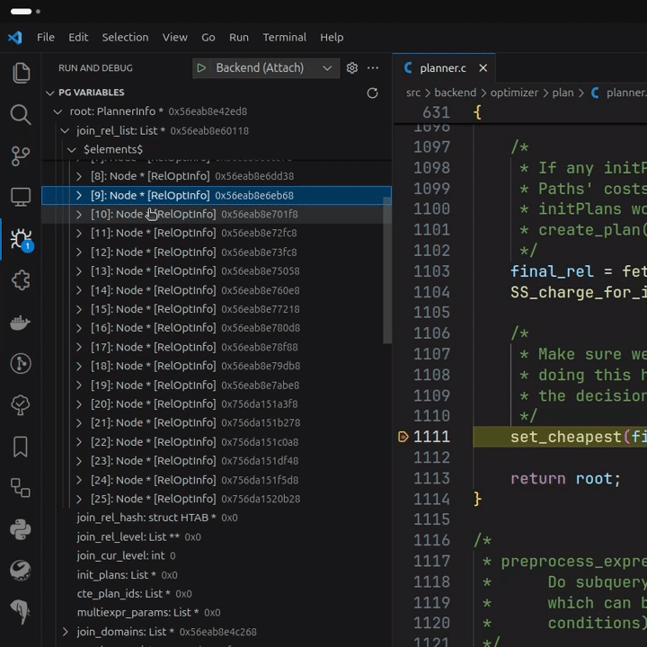
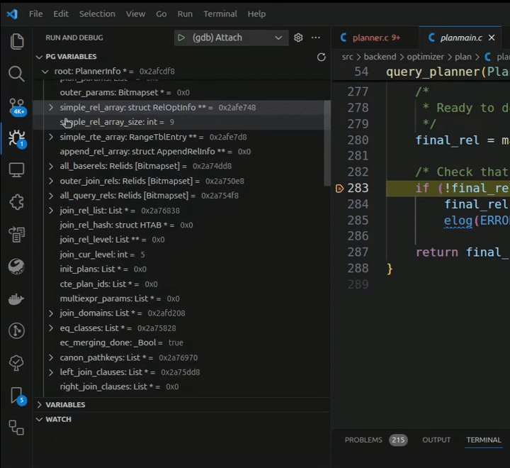
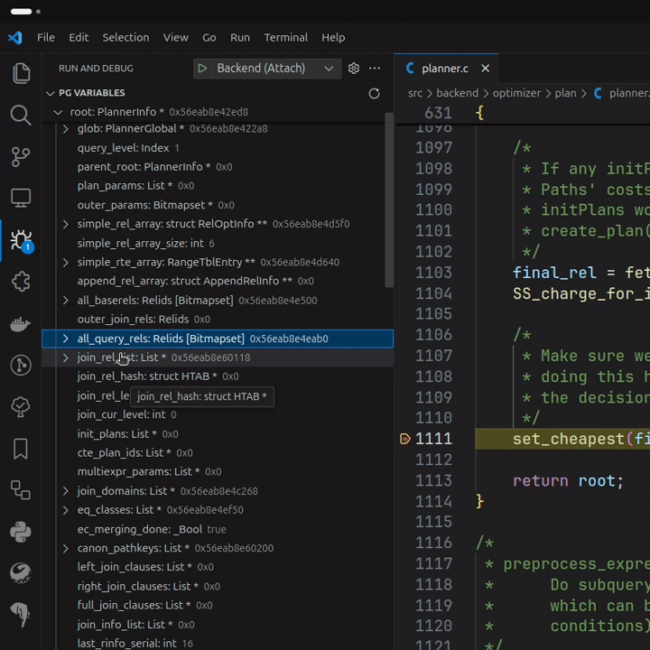

# PostgreSQL Hacker Helper


This is a Visual Studio Code extension to assist PostgreSQL source code
developers. It allows to investigate `Node *` variables to obtain it's real type
based on `NodeTag` and provide some other utilities.

## Features

More info you can find in documentation for [pg variables view](docs/pg_variables.md).

### Investigate real type of `Node *`

While debugging you can observe variables of `Node *` type with it's real type.
They appear in separate action view.


It behaves like Debug->Variables view, but no colorization (limitations of VS
Code Extension framework) and automatically detects real type of `Node *`
variables.

### Show contents of containers

Extension support showing contents of containers: `List` (including subtypes)
and `Bitmapset`.


`Bitmapset` elements are displayed:

- `$elements$` - elements of set (array of integers)
- `$length$` - number of entries in set



Also, there is support for C-arrays (like `PlannerInfo->simple_rel_array`) - 
array is displayed using it's length.



Currently, there are 36 registered array members, but you can add your own
using [pgsql_hacker_helper.json](#pgsql_hacker_helperjson) configuration file.

### Show where Bitmapset references

`Bitmapset` and `Relids` often store indexes of other elements in other places.
Extension knows 53 such elements. I.e. `PlannerInfo->all_relids` or `RelOptInfo->eclass_indexes`.



### Dump `Node *` state to log

In PostgreSQL there is `pprint(Node *)` which dumps passed Node variable to
stdout with pretty printing it. Using 'Dump Node to log' option in variable
context menu you also will be able to do so.


### Formatting

Extension uses `pgindent` for formatting C code. It integrates with VS Code
extension and available with `Format Document` or `Ctrl + Shift + I` shortcut
(or another key binding if overridden).

To enable this set formatter for C in settings (i.e. `.vscode/settings.json`
for workspace):

```json
{
    "[c]": {
        "editor.defaultFormatter": "ash-blade.postgresql-hacker-helper"
    }
}
```

Or specify formatter manually using `Format Document With...`. Select
`PostgreSQL Hacker Helper` in pick up box.


Feature supported for PostgreSQL starting from 10 version.

> This feature using tools from `src/tools`. If they are unavailable extension
> will try to build or download them.
>
> Primary tool required is `pg_bsd_indent`. If PostgreSQL version lower than
> 16 extension will ask you for `pg_config` path - it is required to build
> `pg_bsd_indent`.
> Look for warning message from extension in left bottom corner.

Using command `PgSQL: Show diff preview for PostgreSQL formatter` you can
preview changes made by formatter.

## Customization

### pgsql_hacker_helper.json

This is a configuration file for extension.
It stored inside `.vscode` directory in your repository -
`.vscode/pgsql_hacker_helper.json`. You can use config file to extend built-in
capabilities if there is no support for something yet.

Example json:

```json
{
    "version": 2,
    "specialMembers": {
        "array": [
            {
                "typeName": "PlannerInfo",
                "memberName": "simple_rel_array",
                "lengthExpression": "simple_rel_array_size"
            },
            {
                "typeName": "RelOptInfo",
                "memberName": "partexprs",
                "lengthExpression": "part_scheme->partnatts"
            },
            {
                "typeName": "GatherMergeState",
                "memberName": "gm_slots",
                "lengthExpression": "nreaders + 1"
            }
        ]
    },
    "aliases": [
        {
            "alias": "PlannerRef",
            "type": "PlannerInfo *"
        }
    ]
}
```

In example 3 array special members - arrays will be shown with specified length,
not just pointers to arrays start.
Also, `PlannerRef` - typedef for `PlannerInfo *`.

For more info check [configuration file documentation](./docs/config_file.md).

## Extension Settings

There are 4 settings:

- `postgresql-hacker-helper.logLevel` - Log level

  Minimum level of log messages in Output channel.
  By default - `INFO`. If using VS Code 1.74.0 ang greater use `Output` channel
  logger settings.

- `postgresql-hacker-helper.srcPath` - Path to source code directory
  
  *Relative* path to custom PostgreSQL source code directory. Use it, if source
  code files are not in your workspace root (i.e. in `${workspaceFolder}/postgresql`). Used for searching for
  required files (node tag files, `pg_bsd_indent` and so on). If not specified
  search starts from workspace root. (Next, this settings will be used as `*SrcPath*`).

- `postgresql-hacker-helper.nodeTagFiles` - Files with NodeTag files
  
  List of paths points to files that contain NodeTags.
  
  - If path is absolute - specified files will be used directly.
  - If path is relative, search starts from source files directory (see
  `postgresql-hacker-helper.srcPath`).
  - If not specified, `*SrcPath*/src/include/nodes/nodes.h`
  and `*SrcPath*/src/include/nodes/nodetags.h` will be used.

- `postgresql-hacker-helper.pg_bsd_indentPath` - Path to `pg_bsd_indent`
  
  Path to `pg_bsd_indent` tool. Required for formatting support. Use it if you have `pg_bsd_indent` installed globally or want to use specific version.

  - If not specified, it will be searched in `*SrcPath*/src/tools` directory.
  - If specified, and failed to run extension will try to build it.
  NOTE: If required, it will be downloaded (`wget` is required) and built.

## Compatibility

Extension tries to be compatible with multiple versions of both VS Code and
PostgreSQL.

Minimal supported version of:

- `VS Code` - 1.30
- `PostgreSQL` - 8.0

> It is tested manually and not all use cases might be covered. If you found
> bug specific to some version please [create issue](https://github.com/ashenBlade/postgres-dev-helper/issues).

Also, extension will target latest VS Code version and try to use the full
functionality of new versions. So, use latest VS Code versions to get new
features earlier.

For using formatter minimal supported version is `10`.

## Known Issues

Known issues:

- Only tested on gdb debugger, UB for other debuggers (i.e. lldb)
- If in pointer variable was garbage, extension will not detect it and expand
  this variable (may be garbage)
- To get NodeTags extension reads all available NodeTag files (from settings),
  but these files may be not created (./configure or make not run). I assume by
  time of debugging start files will be created, so extension catch them and
  process.
- Tested only with [ms-vscode.cpptools](https://marketplace.visualstudio.com/items?itemName=ms-vscode.cpptools)
  extension

## Release Notes

### 1.4.0

Add support for custom PostgreSQL source code directories. Custom directory can
be specified using `postgresql-hacker-helper.srcPath` setting.

Fix invalid logging for VS Code with version greater 1.74.0.

### 1.3.0

Add formatting functionality using `pg_bsd_indent` integrated with VS Code:
can use with `Format Document` command or `Ctrl + Shift + I` (keybinding).

Add showing `RangeTblEntry` and `RelOptInfo` to which Bitmapset points.
`RangeTblEntry` shown from `Query->rtable`, `RelOptInfo` - from
`PlannerInfo->simple_rel_array`. Referencing also available for other Bitmapsets
which points not to rte or rel.

### 1.2.1

Add check for breakpoint in `bms_first_member` to avoid infinite loop.

Add support for `MemoryContext` Node.

### 1.2.0

Expand range of supported versions both for PostgreSQL (from 8.0) and VS Code
(from 1.30).

Add support for Bitmapset for versions below 16.

Add support for List with Linked List implementation.

Fix log level updated only after extension or VS Code reload.

Fix invalid Node cast in some cases when declared type has `struct` keyword.

### 1.1.2

Fix invalid `List` behaviour with different declared type - members shown for
declared type, not `List` members.

Add 137 new array special members.

Optimize extension activation performance.

Treat `Plan` struct as Node variable.

### 1.1.1

Fix Bitmapset elements not shown for postgres version below 17

### 1.1.0

Add support for `Bitmapset` and `Relids` - show elements of set.

Add custom user type aliases for Node types in configuration

Update config file layout. Current version - 2.

Hide postgres variables view when not in debug mode.

### 1.0.0

Remove EPQState from array special members

Add T_XidList support

### 0.2.0

Add more special members.

Separate json configuration file to add your own special members.

Specifying real NodeTag in variable name if it differs from declared type. Shows
in square brackets.

Setup logging infrastructure. Availability to change minimum log level.

Command and button to force refresh Pg variables view.

Setting to add custom files with NodeTags.

### 0.1.1

Only valid pointers are expanded in Pg variables view

### 0.1.0

Displaying of `Node *` variables in separate view in Debug view container.

Call `pprint(Node *)` on selected variable in `Variables` view.

## Contributing

Go to [Issues](https://github.com/ashenBlade/postgres-dev-helper/issues) if you
want to say something: bugs, features, etc...
