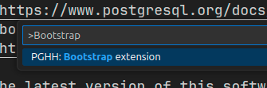
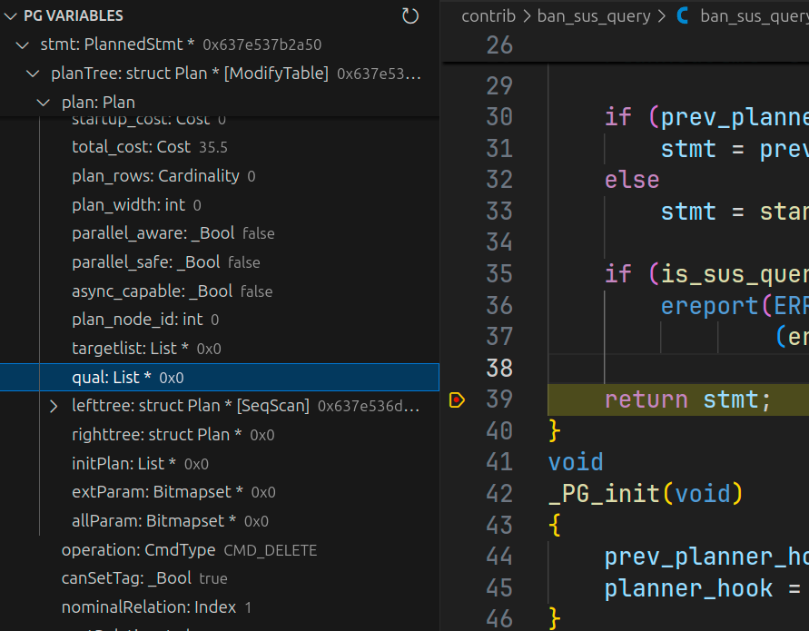
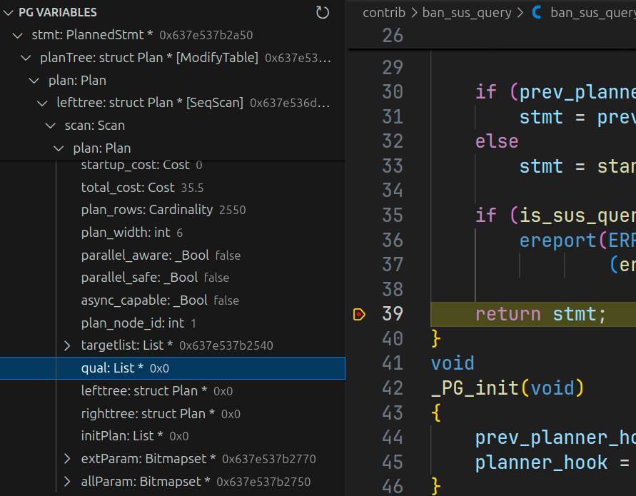
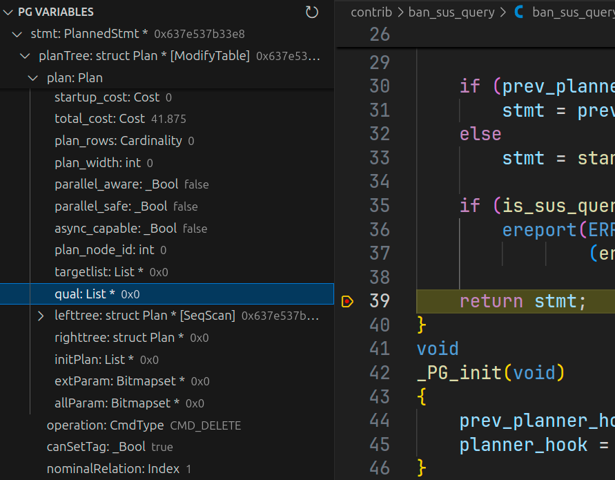
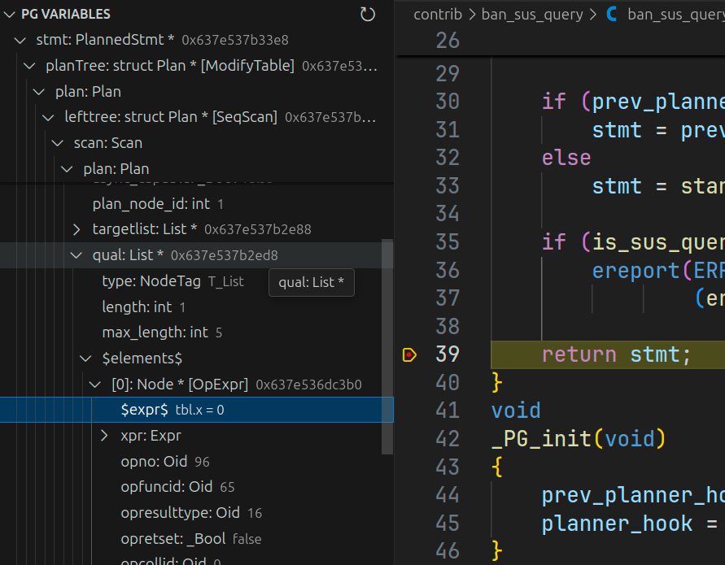
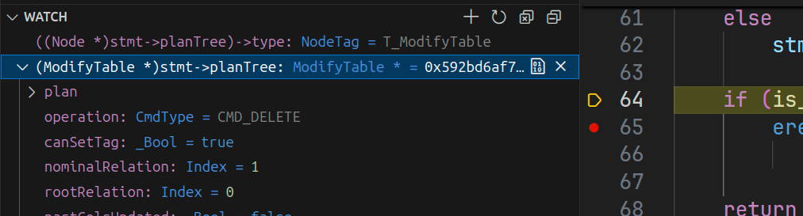
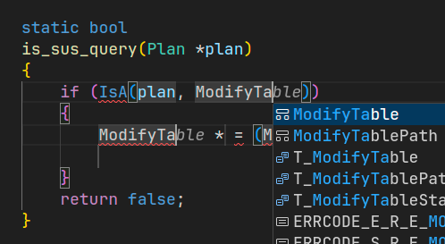
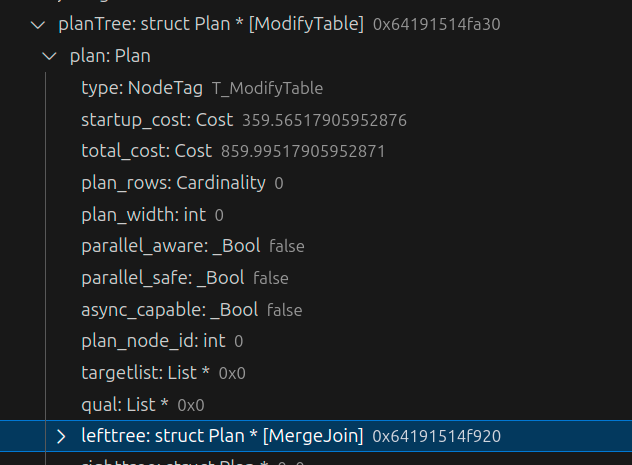
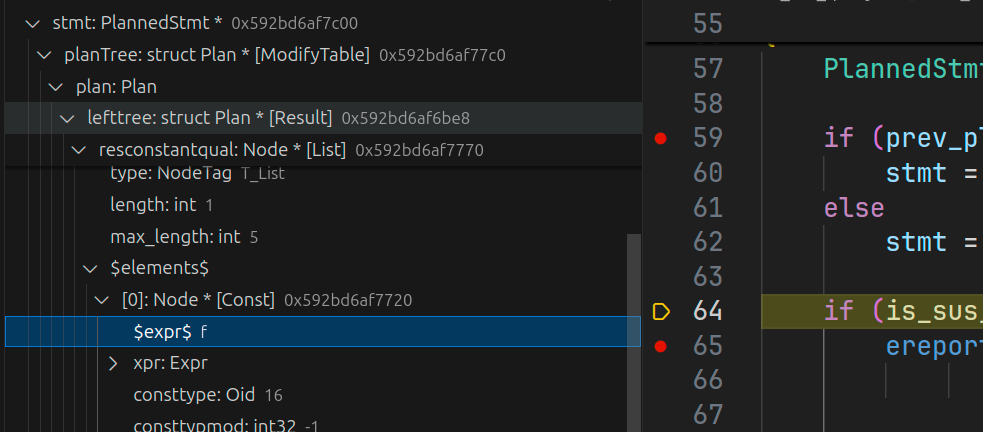

# Tutorial: creating extension

In this tutorial we will create extension `ban_sus_query`. It will check that DML queries contain predicates, otherwise will just throw an error.

> Next, in order not to mislead up, I will use term `contrib` for PostgreSQL extension, and for `extension` for PostgreSQL Hacker Helper VS Code extension.

## Creating initial files

PostgreSQL has infrastructure for contrib building and installation. In short, contribs have a template architecture - most parts are common for all.

So, for faster contrib creation we will use command: `PgSQL: Bootstrap extension`.



It will prompt us to bootstrap some files - choose only C sources.

After that we will have our contrib files created:


## Initial code

Query execution pipeline has 3 stages:

1. Parse/Semantic analysis - query string parsing and resolving tables
2. Plan - query optimization and creating execution plan
3. Execution - actual query execution

Our logic will be added to the 2 stage, because we must check real execution plan, not Query.
This is because after multiple transformations query can be changed in multiple ways - predicates can be deleted or added, therefore we may get a completely different query than in the original query string.

To implement that we will create hook on planner - `planner_hook`. Inside we will invoke actual `planner` and check it's output for the existence of predicates.

Starter code is the following:

```c
#include "postgres.h"

#include "fmgr.h"
#include "optimizer/planner.h"

#ifdef PG_MODULE_MAGIC
PG_MODULE_MAGIC;
#endif

static planner_hook_type prev_planner_hook;

void _PG_init(void);
void _PG_fini(void);

static bool
is_sus_query(Plan *plan)
{
	/* ... */
	return false;
}

static PlannedStmt *
ban_sus_query_planner_hook(Query *parse,
						   const char *query_string,
						   int cursorOptions,
						   ParamListInfo boundParams)
{
	PlannedStmt *stmt;

	if (prev_planner_hook)
		stmt = prev_planner_hook(parse, query_string, cursorOptions, boundParams);
	else
		stmt = standard_planner(parse, query_string, cursorOptions, boundParams);
	
	if (is_sus_query(stmt->planTree))
		ereport(ERROR,
				(errmsg("DML query does not contain predicates")));

	return stmt;
}
void
_PG_init(void)
{
	prev_planner_hook = planner_hook;
	planner_hook = ban_sus_query_planner_hook;
}

void
_PG_fini(void)
{
	planner_hook = prev_planner_hook;
}
```

Now we are ready to add "business-logic", but before let's understand how such suspicious queries look like.

## Examine queries

Suspicious query - is a DELETE/UPDATE query that does not contain predicates.

One of the benefits that we are checking already planned statements is that all predicates are already optimized in a sense that boolean rules are applied.

Query plan - is a tree of `Plan` nodes. Each `Plan` contains `lefttree`/`righttree` - left and right children and `qual` - list of predicates to apply at this node. But we must check only UPDATE/DELETE nodes, not each node, - nodes for them is `ModifyTable`.

Thus our goal is:

> traverse query tree, find `ModifyTable` and check that it's `qual` is not empty

But, before run sample queries to look what their queries looks like (inside) and which predicates they have.

For tests we will use this setup:

```sql
-- Schema
CREATE TABLE tbl(x int);

-- Test queries
DELETE FROM tbl;
DELETE FROM tbl WHERE x = 0;

UPDATE tbl SET x = 1;
UPDATE tbl SET x = 1 WHERE x = 0;
```

To do this we will use our contrib - install it using `make install`, add to `shared_preload_libraries='ban_sus_query'` and put a breakpoint to `return` in `ban_sus_query_planner_hook` function.

When we run first DELETE query without predicate, we will see the following:

1. `PlannedStmt` contains top-level `ModifyTable` with empty `qual` list

    

2. Inner `SeqScan` also contains empty `qual` list

    

Now run `DELETE` query with predicate:

1. `PlannedStmt` still contains empty `qual` list

    

2. Inner `SeqScan` now contains `qual` with single element - equality predicate

    

This is no surprise, because our `ModifyTable` does not apply any filtering - it just takes tuples from children (note, that by convention single-child nodes store them in `lefttree`), so it's `qual` is empty, but filtering is applied to `SeqScan` - we must check this.

> As you can mention, extension shows all Node variables with actual types, without showing generic `Plan` entry.
> Also extension is able to show you elements of container types (`List *` in this example).
> More than that, it renders `Expr` nodes (expressions) as it was in a query, so you do not have to manually check each field, trying to figure out what expression it is.
>
> In vanilla PostgreSQL you would have to evaluate 2 expressions: (first) get `NodeTag` and (second) cast variable to obtained `NodeTag`.
> In this example, to show `stmt->planTree` all you need to do is expand the tree node in variables explorer, but manually (without extension), you need to evaluate (i.e. in `watch`) 2 expressions/steps:
>
> 1. `((Node *)planTree)->type` get `T_ModifyTable` - tag of `ModifyTable` node, and then
> 2. `(ModifyTable *)planTree` - show variable with real type.
>
> 
>
> Such manipulations take roughly 5 second, but, as this time accumulates, totally it can take up to 1 hour in a day - just to show variable's contents!
>
> But there is not such support for `Expr` variables - you will not see their representation.
> For this you have to dump variable to log using `pprint` function, which is not very convenient when you developing in IDE.

Now we are ready to write some code.

## `is_sus_query` implementation

I repeat, our goal is to *traverse query tree, find `ModifyTable` and check that it's `qual` is not empty*, but now we can refine it:

> Search for `ModifyTable` in `Plan` tree and check that it's children have non-empty `qual` list

As tree traversal is a recursive function, we will use 2 recursive functions:

- `is_sus_query` - main function that traverses plan tree to find `ModifyTable` node, and when it finds one invokes...
- `contains_predicates` - function that checks that this `Plan` node contains any predicate in a query

Let's start with `is_sus_query`. All we have to do here is to check that `Plan` is a `ModifyTable` and if so, then check that it's children contain predicates.

Node type checking is a frequent operation, so extension ships with some snippets - one of them is a `isaif`, which expands to `if(IsA())` check:



When we have determined, that it is a DML operation check that it is DELETE or UPDATE, because `ModifyTable` is used for other operations, i.e. `INSERT`. This is not hard - just check `operation` member.

```c
static bool
is_sus_query(Plan *plan)
{
    /* ... */
	ModifyTable *modify = (ModifyTable *)plan;
	switch (modify->operation)
	{
		case CMD_UPDATE:
		case CMD_DELETE:
			/* Check predicates */
            break;
		default:
			break;
	}
	/* ... */
}

```

And now check these operations contain predicates using `contains_predicates` function (will be defined further).

Also, do not forget to handle recursion: call `is_sus_query` for children and handle end case (`NULL`).

The result function looks like this:

```c
static bool
is_sus_query(Plan *plan)
{
	/* Recursion end */
	if (plan == NULL)
		return false;

	if (IsA(plan, ModifyTable))
	{
		ModifyTable *modify = (ModifyTable *)plan;
		switch (modify->operation)
		{
			case CMD_UPDATE:
			case CMD_DELETE:
				return !contains_predicates(modify->plan.lefttree);
			default:
				break;
		}
	}
	
	/* Handle recursion */
	return is_sus_query(plan->lefttree) || is_sus_query(plan->righttree);
}
```

## `contains_predicates` implementation

Now perform actual checking of the predicates existence using `contains_predicates`. Inside this function we must check that given `Plan` contains predicates.

But situation is complicated by the fact that only base `Plan` is given and we do not know actual query. For example this query:

```sql
DELETE FROM t1 using t2 where t1.x = t2.x;
```

Will contain JOIN in `lefttree` of `ModifyTable`:



Thus we have to clarify what does `contains_predicates` must check. In order not to complicate things a lot, we will just find first node with any predicate.

```c
static bool
contains_predicates(Plan *plan)
{
    if (plan == NULL)
        return false;

    if (plan->qual != NIL)
        return true;
    
    return contains_predicates(plan->lefttree) || contains_predicates(plan->righttree);
}
```

## Testing

First things first - test on example queries we defined above:

```sql
postgres=# delete from tbl;
ERROR:  DML query does not contain predicates
postgres=# delete from t1 where x = 0;
DELETE 0

postgres=# update tbl set x = 0;
ERROR:  DML query does not contain predicates
postgres=# update tbl set x = 0 where x = 0;
UPDATE 0
```

It's working as expected.

Also, as we injected our contrib as the last step, we can handle more complicated cases, like:

```sql
postgres=# delete from t1 where true;
ERROR:  DML query does not contain predicates
```

## Further improvements

This is just the beginning of the contrib, because there are lot's of corner cases that are not handled.

For example, if we change `true` to `false` in last query, then we still will get an `ERROR`.
That is because the database has realized that subquery will not return anything, so replaced with "dummy" Plan - `Result` node with `FALSE` one-time check, so nothing will be returned:



## Result

So far we have seen how you can quickly create new contrib using single command that will create all necessary files.

To write some templated code, we used `isaif` snippet to quickly add check for Node type.

Also, we have traversed query plan tree and saw it's nodes, without requirement to obtain `NodeTag` and cast to given type, which incredibly boosts performance.

And like the icing on the cake we saw expression representations of predicates. For our purposes this is not a very big deal, because query contained only 1 predicate, but in large queries with dozens of different predicates it's just a lifesaver.
