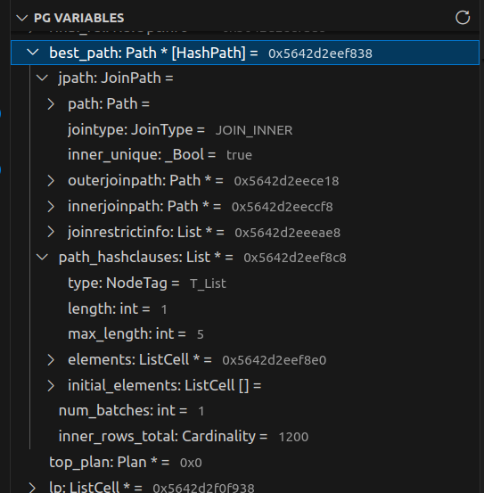
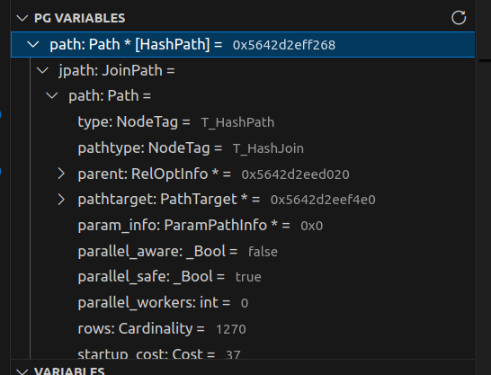
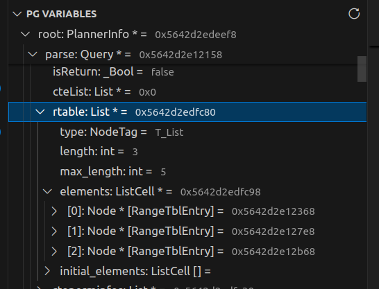
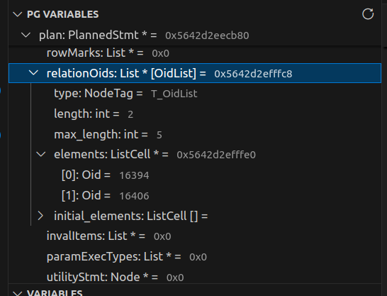
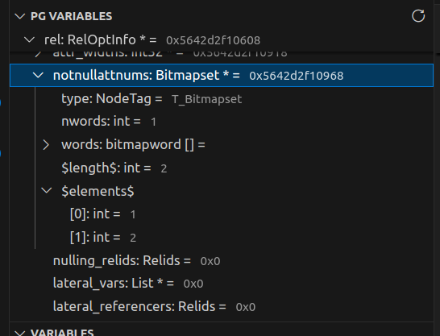
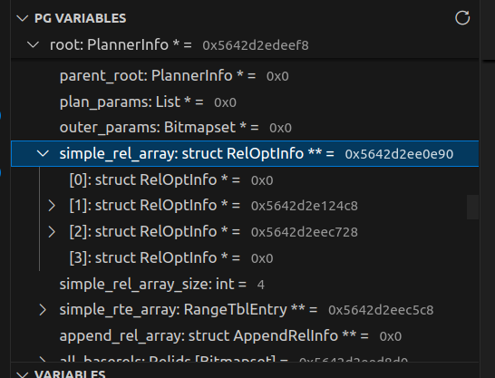

# Postgres variables

Extension shipped with `Pg variables` view in debug view container.
It shows up while debugging and allows investigation of types
with special processing of some.

## Variables view

While debug session there is `Pg variables` view available in debug view container.

It contains all variables that available in default `variables` view, but
stored variables are processed by extension.
Description of processing methods are [below](#type-exploring).

This view refreshed after each step, but you can force refresh it using
refresh button in right upper corner.

Each pointer variable are checked: if `NULL` - no processing performed
and it can not be expanded (expand button not shown).
But there are can be false positive - when there are garbage (i.e. for
not initialized stack allocated) with value like `0x4`. Extension
treat it like normal and tries to expand. No errors observed yet,
but be careful.

## Type exploring

Main feature of this extension is exploration of variables in PostgreSQL source code. It involves several cases (kind of types):

- Node type
- Array members
- Simple type (or member)
- Hash tables

### Simple type

This kind of type is plain old type without extra meaning:

- Built-in types
- Pointers to structs or built-in types
- Simple structs

These processed in usual way (as in default variables view).

Examples:

- `int`
- `float`
- `_Bool`
- `struct NameData`
- `typedef NameData *Name`

### Node type

Node type - is a type that may have `NodeTag` first field. I.e. `List`, `PlannerInfo` etc...

Info about these type is taken from files, that may have this enum: `src/include/nodes/node.h`, `src/include/nodes/nodetags.h`.
They are parsed on extension activation.
This is configuration parameter and can be modified, but default
values seems to be ok.

Default processing done in this way:

1. Encounter variable with Node type in it
2. Get real NodeTag - cast to `Node *` and get `type` field
3. Cast variable to extracted type if:
   - Extracted `NodeTag` is valid
   - Extracted `NodeTag` differs from declared type

After getting real NodeTag, variable is casted to corresponding type and
all members shown for real type (not declared).

Example:

- In some `walker` function argument is `Node *`, but in `Pg variables` view
  it will be casted to real type.
- `Path *` variables will be shown according real subtype, i.e. `AggPath *`

If real NodeTag differs from corresponding from declared type, real NodeTag
is shown right after type in square brackets.

Example:



> First condition in step 3 to check if there is garbage

Also, there are some Special Node types:

- List - show `elements` members according to tag
  - `List`
  - `IntList`
  - `OidList`
  - `XidList`
  
  Additionally, you can specify custom pointer type in `List`. See [custom `List` types](./config_file.md#custom-list-types) section in configuration file documentation.

- Bitmapset - show elements of set in pseudo-member `$elements$`

    > WARNING: to obtain elements of set we use debugger evaluation of
    > `bms_next_member` function. If there is breakpoint in -
    > we will fall into **infinite recursion and crash**.
    >
    > To prevent this, we do not introspect set if there are *any*
    > breakpoints in `bitmapset.c` source file (even if breakpoint
    > set not in `bms_next_member` function).
    > Currently, I did not find any way to check this function directly.

Examples:

- `Path` has real type of `HashPath`

    

- `List`

    

- `List` with `T_OidList`

    

- `Bitmapset`

    

> NOTE: if there were garbage, extension can mistake and cast variable to
> wrong NodeTag. For example, `List` can be casted to `PathTarget`.
> It is up to you to detect such errors for now.

### Aliases

`Relids` - is a typedef for `Bitmapset *`, but it does not have
corresponding NodeTag.

There is support for such cases - aliases.

In configuration file (start from 2 version) there is top level
`alises` field - array of type aliases info.

Example:

You create extension and have typedef for `PlannerInfo` -
`typedef PlannerInfo *Sample`. By default, extension will
not detect this, because there is not `T_Sample` tag.
You should add this to config file:

```json
{
    "alises": [
        {
            "alias": "Sample",
            "type": "PlannerInfo *"
        }
    ]
}
```

> NOTE: this only works if `type` is Node type

### Array members

Array member - is a member of some struct that stores pointer to array with it's length stored in another member.

Example:

```c
struct Sample
{
    /* Array of structs */
    struct PlannerInfo **planners;
    /* Contains length of 'planners' array */
    int planners_count;
}
```

To add support for this you can use this configuration:

```json
{
    "arrays": [
        {
            "typeName": "Sample",
            "memberName": "planners",
            "lengthExpression": "planners_count"
        }
    ]
}
```

There are lots of builtin supported array members. For example, `simple_rel_array` for `PlannerInfo`



> For more info about configuration check [documentation](config_file.md)
