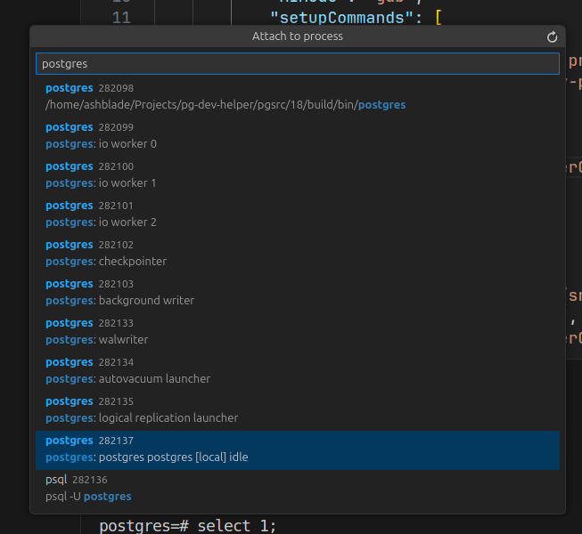
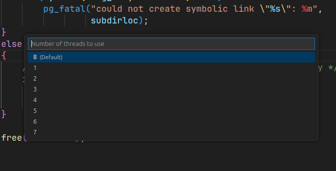

# Visual Studio Code setup

Here is shown VS Code setup for PostgreSQL debugging.

## Extensions

### PostgreSQL Hacker Helper

This is the main extension we are talking about. It significantly simplifies development and debugging of source code.

[Link to the extension](https://marketplace.visualstudio.com/items?itemName=ash-blade.postgresql-hacker-helper).

This is the only extension I recommend installing, because there are no alternatives to it.
For the further extensions you are free to choose that suit you - no restrictions, just suggestions.

### Debugger extension

First things first, you have to install debugger extension, which will provide debugging functionality.

There are 2 supported (by PostgreSQL Hacker Helper) debugger extensions:

- [C/C++](https://marketplace.visualstudio.com/items?itemName=ms-vscode.cpptools)
- [CodeLLDB](https://marketplace.visualstudio.com/items?itemName=vadimcn.vscode-lldb)

Which one to choose is up to you, but I use a rule of thumb: if have built source code using `gcc`, then C/C++ with `dbg` debugger, otherwise (`clang`) use `CodeLLDB` with `lldb` debugger.

Also, you would like to have autocompletions. You can use [IntelliCode Completions](https://marketplace.visualstudio.com/items?itemName=VisualStudioExptTeam.vscodeintellicode-completions).

### Perl

PostgreSQL has different test types. One of them is TAP-tests which are written in Perl, so you might want to add extension with Perl support.

Example, [Perl](https://marketplace.visualstudio.com/items?itemName=richterger.perl) extension.

If you have chosen extension above, then you should know, that this extension caches parsed `*.pl` files and stores them in `.vscode/perl-lang` directory (can be changed in settings).
Such behavior can interfere with other IDE functions (i.e. file search) or slow down performance, so you should add this folder to excludes.
Sample configuration can look like this (`settings.json`):

```json
{
    // Exclude from search output list
    "search.exclude": {
        "**/.vscode/perl-lang": true
    },
    // Exclude from tracked FS events
    "files.watcherExclude": {
        "**/.vscode/perl-lang": true
    },
    // Do not even show this directory in explorer
    "files.exclude": {
        "**/.vscode/perl-lang": true
    }
}
```

### Markdown

This is utility extension that will help create markdown files.
They are popular because many documentation or README are written using Markdown syntax.

Example: [Markdown All in One](https://marketplace.visualstudio.com/items?itemName=yzhang.markdown-all-in-one).

### SQL queries

SQL is the main language, so SQL-syntax support is must-have.

You can use builtin SQL syntax support, or install [Better PostgreSQL syntax](https://marketplace.visualstudio.com/items?itemName=felixfbecker.postgresql-syntax) extension which provides several PostgreSQL specific syntax features, like type cast.

### Database connections

When developing you may need to connect to database and execute queries.
For this you can choose any tool: `psql`, `pgAdmin` or vs code extension.

There is no recommendation, because I do not use VS Code extension: only `psql` or `pgAdmin`, because VS Code extension targets primarily on Database usage while I am as database *source code* developer can request specific features that general extension does not provide. In example, I can create patch, that breaks binary protocol compatibility or adds extensions to it, which is obviously not supported by extension. Thus it is more preferable to have your own automation scripts.

Moreover, you may have multiple different versions of PostgreSQL installed on your system simultaneously and again, it is unlikely that the general solution (extension) takes into account such features.

## `launch.json`

> [Link to file on GitHub](https://github.com/ashenBlade/postgres-dev-helper/tree/master/misc/vscode/launch.json)

File `.vscode/launch.json` describes debug session configuration: name, debugger, path to binary/pid to attach, launch args, etc...
When we are talking about PostgreSQL you should remember that it has multi-process architecture, not multi-threaded, this defines how we start debugging.
Next, typical configurations for different uses cases will be presented.

### Backend

Mostly you will be debugging a backend. It forks from postmaster, setup it's own state and then start main query processing loop.
As it forks, then we can not just launch backend as usual binary - we have to attach to specific pid.

```json
{
    "version": "0.2.0",
    "configurations": [
        {
            "name": "Backend (cppdbg)",
            "type": "cppdbg",
            "request": "attach",
            "program": "${workspaceFolder}/src/backend/postgres",
            "processId": "${command:pickProcess}",
            "MIMode": "gdb",
            "setupCommands": [
                {
                    "description": "Enable pretty-printing for gdb",
                    "text": "-enable-pretty-printing",
                    "ignoreFailures": true
                }
            ],
            "internalConsoleOptions": "neverOpen", 
        },
        {
            "name": "Backend (lldb)",
            "type": "lldb",
            "request": "attach",
            "program": "${workspaceFolder}/src/backend/postgres",
            "pid": "${command:pickProcess}",
            "internalConsoleOptions": "neverOpen"
        }
    ]
}
```

These are template configurations created by default, but with some customization:

1. To get PID of process special value is used: `${command:pickProcess}` - it will open quick pick window where you can choose backend to attach.
   It shows all running processes, but actually all you have to do is to type "postgres" and choose penultimate element - usually it is the only running backend.
   
2. `"program"` points to `src/backend/postgres` - default location of `postgres` binary. It contains all server debug symbols and it's location do not change, so you do not have to specify installation path each time.
3. `internalConsoleOptions` is set to `neverOpen` because when debugging starts C/C++ extension opens `Debug Console` and shows logs, but usually it is not necessary and just only knocks down the focus.

### Frontend

Frontend - are all utilities that run outside the server, i.e. `pg_dump`, `pg_ctl`, etc...

They are separate binaries, so you can launch them directly, but usually they interact with the database, so they need database installation info.

We can pass it directly using flags, but a better idea would be to use environment variables, because different binaries can use different flags.

After installation all frontend utilities will be located in `PGINSTDIR` - directory specified during database setup, so all you have to do is just pick required binary in it.

For example configuration for `pg_ctl` would be:

```json
{
    "version": "0.2.0",
    "configurations": [
        {
            "name": "pg_ctl",
            "type": "cppdbg",
            "request": "launch",
            "program": "${workspaceFolder}/build/bin/pg_ctl",
            "cwd": "${workspaceFolder}",
            "args": [
                "status"
            ],
            "environment": [
                {
                    "name": "PGDATA",
                    "value": "${workspaceFolder}/data"
                }
            ]
        }
    ]
}
```

Here we are debugging `pg_ctl status` command (see `"args"`) and pass `PGDATA` environment variable directly.

The value of it can be any, but in the example I suppose that for development purposes your installation in `data` directory in the repository itself.

A better idea than passing environment variables would be to pass environmental variable *file*.
It have 2 benefits against manual specifying:

1. This file can be automatically generated during database creation
2. If you have configuration for multiple binaries, then you do not have to enter the same parameters - just pass this env file.

On [Development scripts](./dev_scripts.md#buildsh) page are shown useful development scripts, one of them (`build.sh`) will create special `.env` file, which contains all generated environment variables, so you can just specify this file:

```json
{
    "version": "0.2.0",
    "configurations": [
        {
            "name": "pg_ctl",
            "type": "cppdbg",
            "request": "launch",
            "program": "${workspaceFolder}/build/bin/pg_ctl",
            "cwd": "${workspaceFolder}",
            "args": [
                "status"
            ],
            "envFile": "${workspaceFolder}/scripts/.env"
        }
    ]
}
```

### CoreDump

Sometimes SEGFAULT happens or `Assert` test fails. In such cases a coredump will be created (you can enable them using `ulimit -c unlimited` shell command from root).

C/C++ extension has special configuration for debugging CoreDump:

```json
{
    "version": "0.2.0",
    "configurations": [
        {
            "name": "CoreDump",
            "type": "cppdbg",
            "request": "launch",
            "program": "${workspaceFolder}/src/backend/postgres",
            "cwd": "${workspaceFolder}",
            "coreDumpPath": "${input:coreDumpPath}"
        }
    ],
    "inputs": [
        {
            "id": "coreDumpPath",
            "type": "promptString",
            "description": "Enter path to CoreDump"
        }
    ]
}
```

To start debugging core dump you have to enter path to core dump file in prompt.

> PostgreSQL Hacker Helper also works with core dumps.

## `tasks.json`

> [Link to file on GitHub](https://github.com/ashenBlade/postgres-dev-helper/tree/master/misc/vscode/tasks.json)

Another useful functionality of VS Code are Tasks. In short, Task - is a named command, which can be any shell script.

The schema of task entry is very simple:

```json
{
    "label": "Name of task",
    "detail": "Description of a task",
    "command": "path/to/command",
    "args": [
        "additional",
        "args",
        "to",
        "command"
    ],
}
```

On [Development scripts](./dev_scripts.md) page we have defined some useful scripts and now it's time to integrate them into IDE.

This file can be very large, so here we define the most common and necessary.

### Build

To build we can use `build.sh` script. It accepts `--build` flag, that starts building.
But it also accepts number of threads to use and we will use it.

```json
{
    "version": "2.0.0",
    "tasks": [
        {
            "label": "Build",
            "command": "${workspaceFolder}/scripts/build.sh",
            "args": [
                "--build",
                "-j",
                "${input:threads}"
            ],
            "detail": "Run build and install DB with all contribs",
            "group": {
                "kind": "build",
                "isDefault": true
            }
        }
    ],
    "inputs": [
        {
            "id": "threads",
            "type": "pickString",
            "options": [ "1", "2", "3", "4", "5", "6", "7", "8" ],
            "default": "8",
            "description": "Number of threads to use"        
        }
    ]
}
```

As you can see this task runs our `build.sh` script and passes number of threads to it.
And number of threads is prompted interactively using quick-pick - you can see example on screenshot below.



More than that, we also added a `"group"` member. What did it give us? Now we can run build just by using shortcut `Ctrl + Shift + B`. And that's it - build is running!

### Running PSQL

Next step after compilation is a database creation and connecting to it. For this task we have `run.sh` script which manages database instance.

It may seem annoying to constantly run the same task sequence: `Init database` -> `Run database` -> `Run PSQL`. So we will combine all 3 commands into single task.

```json
{
    "label": "Run psql",
    "detail": "Run psql",
    "command": "${workspaceFolder}/scripts/run.sh",
    "args": [
        "--init-db",
        "--run-db",
        "--psql"
    ],
    "isBackground": true,
}
```

Now just after database compilation has completed you just types `psql` in `Run task` prompt and clicks required task. That's it - you are running PSQL and can send queries!

### Start terminal in database environment

Complex tasks are not that simple, so sometimes you have to do everything manually. For such kind of work you must start a new terminal session using `env.sh` script defined earlier. It will setup environment variables in such way, so you will be working with compiled binaries and database instance.

```json
{
    "label": "Run terminal",
    "detail": "Run terminal with imported environment variables specific to environment",
    "presentation": {
        "echo": true,
        "reveal": "always",
        "focus": true,
        "panel": "shared",
        "showReuseMessage": false,
        "clear": false
    },
    "command": "/usr/bin/sh",
    "args": [
        "-c",
        ". ${workspaceFolder}/scripts/env.sh; $SHELL"
    ],
    "isBackground": true
},
```

After launching this task a new shell with all PG env variables will be created.

### Other scripts

In `tasks.json` file you can find more predefined tasks for VS Code. They include:

- Running tests (using `Ctrl + Shift + T` shortcut)
- Managing database instance
- Cleaning files

### Tips & tricks

To run task you must run command in pallette: `Tasks: Run task` and then enter command label which you want to execute.
As tasks are executed often you may want to speed up this process.

You can bind a shortcut to open task name prompt immediately.
I.e. you can bind `Alt + T` or other combination.


